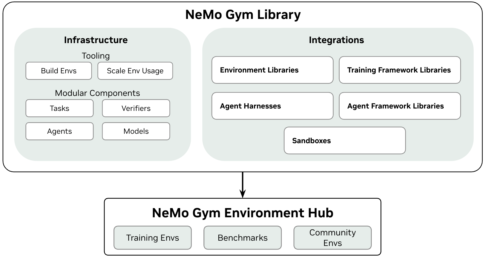

# NeMo Gym

NeMo Gym is a library for evaluating and improving models and agents using environments. NeMo Gym provides infrastructure to develop environments, scalably run evaluation and training, and a collection of popular benchmarks and training environments.

## When to Use NeMo Gym

- You need to **evaluate models or agents** in stateful environments (e.g. code execution, tool calling, sandboxes)
- You want **reproducible evaluation** across teams using shared environments and verifiers
- You need to use environments **at scale** — multiple repeats per task, or thousands of concurrent requests for training
- You want to **seamlessly transition** between evaluation, agent optimization, and training

If you're scoring model outputs with a stateless check and don't need scale or training, a script is probably sufficient.

## What NeMo Gym Provides

- Modular, extensible interfaces for agents, environments, tasks, and verifiers
- Environment hub of popular benchmarks and training environments
- Use your own agents or choose from built-in harnesses
- Scale to thousands of concurrent environments
- Train with the RL framework of your choice
- Battle-tested in production Nemotron training

## Integrations

NeMo Gym is integrated with the broader agentic ecosystem:

- **Environment libraries**: seamlessly combine environments and benchmarks from other libraries alongside NeMo Gym environments
- **Training framework libraries**: use environments for SFT and RL training
- **Agent harnesses**: popular agent harnesses for evaluation and training available out of the box
- **Agent framework libraries**: use your custom agent built with agent frameworks in NeMo Gym environments
- **Sandboxes**: isolate agent runtime execution
